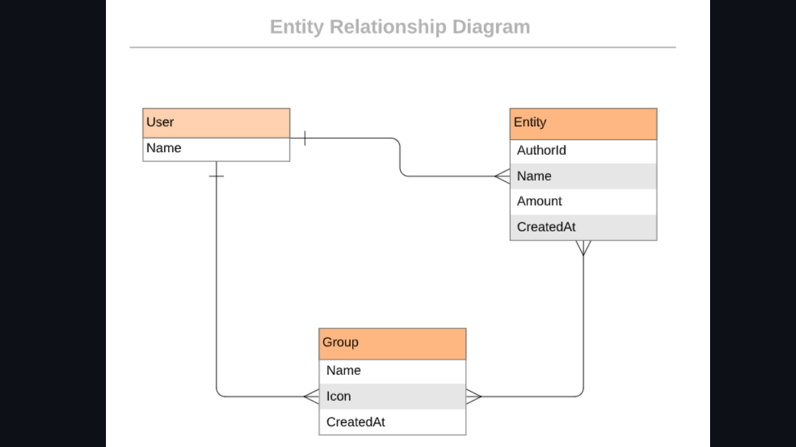

<a name="readme-top" align="center"></a>

<div align="center">
  <h1>Frugal Pal</h1>
  <br/>

</div>

<!-- TABLE OF CONTENTS -->

# 📗 Table of Contents

- [📖 About the Project](#about-project)
  - [🛠 Built With](#built-with)
    - [Tech Stack](#tech-stack)
    - [Key Features](#key-features)
  - [🚀 Live Demo](#live-demo)
- [💻 Getting Started](#getting-started)
  - [Setup](#setup)
  - [Prerequisites](#prerequisites)
  - [Install](#install)
  - [Usage](#usage)
  - [Run tests](#run-tests)
  <!-- - [Deployment](#triangular_flag_on_post-deployment) --> 
- [👥 Authors](#authors)
<!-- - [🔭 Future Features](#future-features) -->
- [🤝 Contributing](#contributing)
- [⭐️ Show your support](#support)
- [🙏 Acknowledgements](#acknowledgements)
- [📝 License](#license)

<!-- PROJECT DESCRIPTION -->

# 📖 FrugalPal <a name="about-project"></a>
FrugalPal - Your budgeting buddy! FrugalPal is an easy-to-use budgeting app that helps you keep track of your spending and achieve your financial goals. With FrugalPal, you can set budgets, track your expenses, and get insights into your spending habits - all in one place.

## 🛠 Built With <a name="built-with"></a>

### Tech Stack <a name="tech-stack"></a>

<details>
  <summary>Server</summary>
  <ul>
    <li><a href="https://www.ruby-lang.org/en/">Ruby</a></li>
  </ul>
</details>

<details>
  <summary>Database</summary>
  <ul>
    <li><a href="https://www.postgresql.org/">PostgreSQL</a></li>
  </ul>
</details>

<!-- Features -->

### Key Features <a name="key-features"></a>
- This Ruby on Rails application allows the user to:
   - register and log in, so that the data is private to them.
   - introduce new transactions associated with a category.
   - see the money spent on each category.

<p align="right">(<a href="#readme-top">back to top</a>)</p>

<!-- LIVE DEMO -->
## 🚀 Live Demo <a name="live-demo"></a>
[Frugal Pal Live Version](https://frugal-pal.onrender.com/)

[Frugal Pal Video Demo](https://www.loom.com/share/5afadb13054b4de296cdea112e11a6c2)


<h2  align="center">APP UI<h2>
 <div align="center">
  
</div>

<h2  align="center">UML Diagram<h2>
 <div align="center">
  
</div>


<p align="right">(<a href="#readme-top">back to top</a>)</p>

<!-- GETTING STARTED -->

## 💻 Getting Started <a name="getting-started"></a>

To get a local copy up and running, follow these steps.

### Prerequisites
In order to run this project you need:

- To install ruby on your PC. You can read [this](https://rubyinstaller.org/downloads/) documentation on how to do so
- To install postgresql on your PC. You can read [this](https://www.postgresql.org/) documentation on how to do so
- Know how to navigate directories or folders at the CLI.
- Know how to get the URL(https/ssh) of a repository on GitHub.
- You should have a code editor installed, preferably VSCode
- In order to run this project you need:

### Setup
In desired folder or directory in the CLI, run the command:

```sh
git clone https://github.com/michaelamponsah/frugal-pal.git
```

Navigate into the cloned folder or repository by running the command:
```sh
cd frugal-pal
```

If VsCode is your default code editor, run:
```sh
code .
```

You are all set up!
### Install

Install this project with:

```sh
 bundle install
``` 
### Usage

To setup the database, run
```sh
rails db:drop db:create db:migrate
```

To run the project, execute the following command:

```sh
ruby bin/rails server
```

### Run tests

To run tests, run the following command:

```sh
  rspec spec spec/[filename.rb]
```

<!-- ### Deployment

You can deploy this project using:

```sh

```  -->

<p align="right">(<a href="#readme-top">back to top</a>)</p>

<!-- AUTHORS -->

## 👥 Author <a name="authors"></a>
👤 **Michael Amponsah**

- GitHub: [@michaelamponsah](https://github.com/michaelamponsah)
- Twitter: [@_mikeamponsah](https://twitter.com/_mikeamponsah)
- LinkedIn: [michaelamponsah](https://linkedin.com/in/mikeamponsah)


<p align="right">(<a href="#readme-top">back to top</a>)</p>

<!-- FUTURE FEATURES -->

## 🔭 Future Features <a name="future-features"></a>
- User profiles - allow users to create a profile page where they can add a profile picture, bio, and other information about themselves.
- User authentication via social media accounts - allow users to sign up and log in to your app using their social media accounts such as Facebook, Twitter, or Google.
- User roles - allow administrators to assign different roles to users, such as moderators, editors, or contributors. This can be useful for managing access and permissions within your app.
- Search functionality - implement a search feature that allows users to search for specific groups, categories, or posts.
- Notifications - add notifications for users to receive updates on new posts, comments, or activity related to their groups or categories.
- Rating system - implement a rating system where users can rate posts, comments, or groups, and display the average rating for each.
- User messaging - allow users to send private messages to each other within Frugal Pal.
- Multi-language support - add support for multiple languages to make Frugal Pal accessible to users from different countries.
- Analytics - track user activity and engagement within your app using analytics tools, such as Google Analytics, to gain insights into how users interact with Frugal Pal.

<p align="right">(<a href="#readme-top">back to top</a>)</p>

<!-- CONTRIBUTING -->

## 🤝 Contributing <a name="contributing"></a>

Contributions, issues, and feature requests are welcome!

Feel free to check the [issues page](https://github.com/michaelamponsah/frugal-pal/issues).

<p align="right">(<a href="#readme-top">back to top</a>)</p>

<!-- SUPPORT -->

## ⭐️ Show your support <a name="support"></a>

If you like this project give us a ⭐

<p align="right">(<a href="#readme-top">back to top</a>)</p>

<!-- ACKNOWLEDGEMENTS -->

## 🙏 Acknowledgments <a name="acknowledgements"></a>

I would like to thank [Microverse](https://github.com/microverseinc) for this project inspiration and Gregoire Vella for UI for this project.

<p align="right">(<a href="#readme-top">back to top</a>)</p>

<!-- LICENSE -->

## 📝 License <a name="license"></a>

This project is [MIT](./LICENSE) licensed.


<p align="right">(<a href="#readme-top">back to top</a>)</p>
